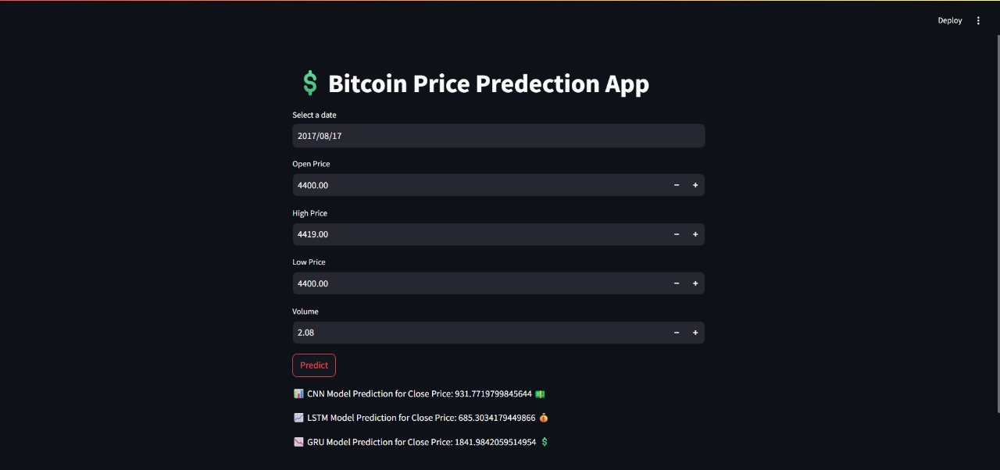
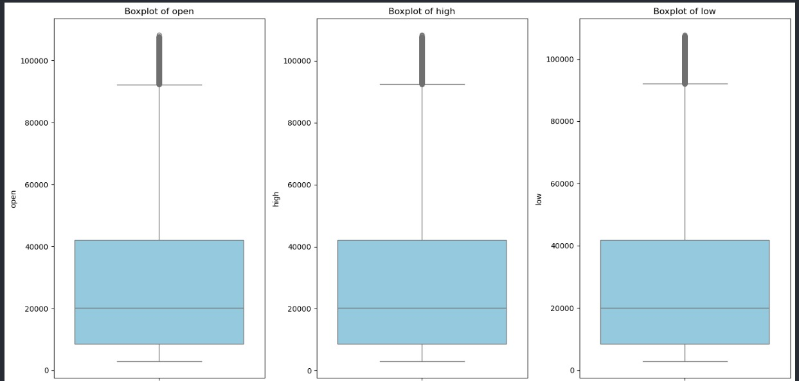
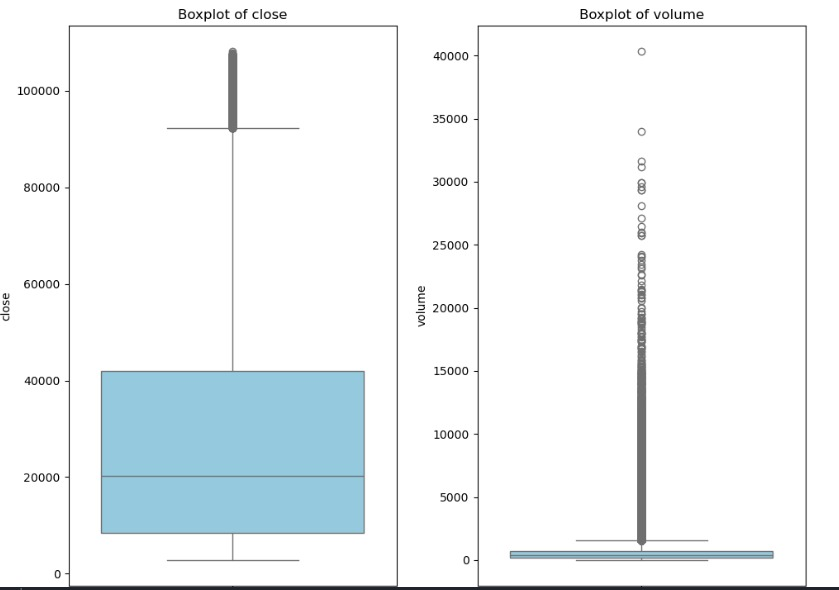

# 💰 Bitcoin Price Prediction Using Neural Networks

A comprehensive machine learning project that predicts Bitcoin closing prices using three different neural network architectures: CNN, LSTM, and GRU. The project includes an interactive Streamlit web application for real-time predictions.


## 👥 Teamwork

This project was collaboratively developed by:

- **Mahmoud Emad Khairy**
- **Ammar Ahmed Farag**
- **Mostafa Mohamed Abdullah**

## 📧 Contact & Support

- 🐙 **GitHub**: [mahmoud554377](https://github.com/mahmoud554377)
- 🐙 **GitHub**: [ammarelbordeny](https://github.com/ammarelbordeny)
- 🐙 **GitHub**: [HagAli22](https://github.com/HagAli22)

## 🎯 Project Overview

This project explores and compares the effectiveness of different deep learning models for cryptocurrency price prediction. By analyzing historical Bitcoin data including OHLCV (Open, High, Low, Close, Volume) information, we built predictive models that can forecast future closing prices with high accuracy.

## 🧠 Models Implemented & Performance

## 📊 Model Comparison Table

| Model | Test R² | Validation R² | Test Loss | Val Loss | Notes |
|-------|---------|---------------|-----------|----------|-------|
| 🧠 CNN | 0.936 | 0.693 | 0.002 | 0.001 | Strong on patterns, overfitting signs |
| 📈 LSTM | 0.910 | 0.870 | 0.003 | 0.0002 | Best generalization |
| 📉 GRU | 0.862 | 0.737 | 0.005 | 0.0005 | Lightweight & reliable |


## 🚀 Key Features

- 📊 **Multi-Model Comparison**: CNN, LSTM, and GRU architectures
- 🗳️ **Ensemble Voting**: Combination of LSTM and GRU for improved accuracy
- 🌐 **Interactive Web App**: User-friendly Streamlit interface
- 📈 **Real-time Predictions**: Input market data and get instant predictions
- 📉 **Data Visualization**: Comprehensive Bitcoin price and volume analysis
- 🎯 **High Accuracy**: R² scores up to 0.936 on test data

## 🛠️ Technologies Used

```python
# Core Technologies
Python 3.8+          # Programming language
TensorFlow 2.13+     # Deep learning framework
Streamlit 1.28+      # Web application
NumPy               # Numerical computing
Pandas              # Data manipulation
Scikit-learn        # Machine learning utilities
Joblib              # Model serialization
```

## 📊 Dataset Features

The model uses Bitcoin market data with the following features:
- **📅 Date** - Timestamp of trading data
- **🔓 Open** - Opening price
- **📈 High** - Highest price in the period
- **📉 Low** - Lowest price in the period
- **📊 Volume** - Trading volume
- **🎯 Close** - Closing price (target variable)

## 🖥️ Quick Start

### 1. Clone the Repository
```bash
git clone https://github.com/mahmoud554377/bitcoin-price-prediction.git
cd bitcoin-price-prediction
```

### 2. Install Dependencies
```bash
pip install -r requirements.txt
```

### 3. Run the Streamlit App
```bash
streamlit run app.py
```

### 4. Open Your Browser
Navigate to `http://localhost:8501` and start predicting!

## 📱 Web Application Features



The Streamlit app provides:
- 📝 **Interactive Input Form**: Easy data entry for market parameters (Date, Open, High, Low, Volume)
- ⚡ **Real-time Predictions**: Instant results from all three models
- 📊 **Model Comparison**: Side-by-side CNN, LSTM, and GRU predictions with different emojis
- 💫 **Dark Theme UI**: Professional dark interface with green accent colors
- 🎯 **Precise Results**: High-precision predictions displayed with full decimal accuracy

### Live Example Results:
Based on the screenshot, for input data from 2017/08/17:
- **📊 CNN Model**: 931.77 💵
- **📈 LSTM Model**: 685.30 💰  
- **📉 GRU Model**: 1841.98 💲

### How to Use:
1. **Select Date**: Choose your prediction date (e.g., 2017/08/17)
2. **Enter Market Data**: 
   - Open Price: $4400.00
   - High Price: $4419.00  
   - Low Price: $4400.00
   - Volume: 2.08
3. **Click "Predict"**: Get instant predictions from all three models
4. **Compare Results**: View CNN, LSTM, and GRU predictions side-by-side

## 📈 Model Performance Analysis

### 🏆 Best Performing Model: LSTM
- Most balanced performance between test and validation sets
- Excellent at capturing long-term dependencies in Bitcoin price data
- Validation R² of 0.870 indicates strong generalization

### 📊 Key Performance Insights:
- **LSTM**: Most consistent across different datasets
- **CNN**: High test performance but shows some overfitting
- **GRU**: Good balance between model complexity and accuracy
- **Ensemble**: Combines strengths of multiple models

## 📈 Data Analysis & Visualizations

### Bitcoin Trading Volume Over Time


The trading volume analysis reveals:
- **Peak Activity**: Massive volume spikes during 2023 (up to 40,000+ units)
- **Market Cycles**: Volume correlates with major price movements
- **Volatility Indicator**: High volume periods coincide with market uncertainty

### Bitcoin Price Evolution (2018-2025)


Key price milestones:
- 🚀 **2021 Bull Run**: Reached ~$65,000
- 📉 **2022-2023 Correction**: Market consolidation around $15,000-$30,000
- 🌙 **2025 Surge**: Dramatic rise to over $100,000

### Statistical Distribution Analysis



The box plot analysis shows:
- **Price Distribution**: Open, High, Low, and Close prices show similar distributions with outliers above $100k
- **Volume Extremes**: Significant outliers in trading volume (up to 40,000+ units)
- **Market Behavior**: Typical cryptocurrency volatility patterns with long tails
- **Data Quality**: Clean data with expected financial time series characteristics

## 📁 Project Structure

```
bitcoin-price-prediction/
│
├── 🚀 app.py                 # Streamlit web application
├── 🧠 btc_cnn_model.pkl     # Trained CNN model
├── 📈 btc_lstm_model.h5     # Trained LSTM model  
├── 📉 btc_gru_model.h5      # Trained GRU model
├── ⚙️ scaler.pkl            # Fitted StandardScaler
├── 📓 project.ipynb          # Jupyter notebook with data analysis and model training
├── 📋 requirements.txt      # Project dependencies
├── 📖 README.md             # Project documentation
│
├── 📊 data/                # Dataset files
├── 📓 notebooks/           # Analysis notebooks
├── 🤖 models/             # Model training scripts
├── 📸 images/             # Screenshots and visualizations
│   ├── bitcoin_trading_volume.jpg
│   ├── bitcoin_price_chart.jpg
│   ├── ohlc_boxplots.jpg
│   ├── close_volume_boxplots.jpg
│   └── app_screenshot.jpg

```
## 📓 Jupyter Notebook: project.ipynb

The file [`project.ipynb`](project.ipynb) contains:
- Full **data preprocessing**
- **Exploratory Data Analysis** (EDA) with visualizations
- **Model training** for CNN, LSTM, and GRU
- Performance evaluation and metric calculations
- Saving trained models to disk (`.h5` and `.pkl`)

You can open it in **Jupyter Notebook** or **Google Colab** to explore the training process and modify the model architectures.

➡️ If you're interested in the deep learning side of the project, this is where the magic happens!


## 📊 Setup Instructions for Images

### Image Organization
Create an `images/` folder in your project directory and save your visualization files as:

```
images/
├── bitcoin_trading_volume.png    # Your trading volume chart
├── bitcoin_price_chart.png       # Your price evolution chart  
├── ohlc_boxplots.png             # Your OHLC box plots
├── close_volume_boxplots.png     # Your close/volume box plots
└── app_screenshot.png            # Screenshot of your Streamlit app
```

## 🔮 Future Enhancements

- [ ] **📊 Technical Indicators**: RSI, MACD, Bollinger Bands
- [ ] **📰 Sentiment Analysis**: News and social media integration
- [ ] **🌍 External Factors**: Macro-economic indicators
- [ ] **⚡ Real-time Data**: Live cryptocurrency API integration
- [ ] **🎯 Model Optimization**: Advanced hyperparameter tuning
- [ ] **⚠️ Risk Assessment**: Volatility and risk prediction models
- [ ] **📱 Mobile App**: React Native or Flutter implementation

## 🚀 Deployment

### Streamlit Cloud (Recommended)
1. Push your code to GitHub
2. Go to [share.streamlit.io](https://share.streamlit.io)
3. Connect your repository
4. Deploy with one click!

### Local Development
```bash
# Install dependencies
pip install -r requirements.txt

# Run the app
streamlit run app.py
```

## 🤝 Contributing

Contributions are welcome! Here's how you can help:

1. **🍴 Fork** the repository
2. **🌿 Create** a feature branch: `git checkout -b feature/amazing-feature`
3. **💾 Commit** your changes: `git commit -m 'Add amazing feature'`
4. **📤 Push** to the branch: `git push origin feature/amazing-feature`
5. **🔄 Open** a Pull Request

### Areas for Contribution:
- 🐛 Bug fixes and improvements
- 📊 New model architectures
- 🎨 UI/UX enhancements
- 📖 Documentation improvements
- 🧪 Additional testing

## 📊 Model Training Details

### Data Preprocessing:
- **Normalization**: StandardScaler for feature scaling
- **Window Size**: 30-day sequences for time series modeling
- **Train/Test Split**: 80/20 split with temporal ordering maintained

### Model Architectures:
- **CNN**: Convolutional layers for pattern recognition
- **LSTM**: Bidirectional LSTM for sequence modeling
- **GRU**: Simplified gated recurrent architecture

## 📄 Requirements

```txt
streamlit==1.28.0
tensorflow==2.13.0
numpy==1.24.3
pandas==2.0.3
scikit-learn==1.3.0
joblib==1.3.2
matplotlib==3.7.2
seaborn==0.12.2
```

## 📜 License

This project is licensed under the MIT License - see the [LICENSE](LICENSE) file for details.

## ⚠️ Disclaimer

> **Important**: This project is for educational and research purposes only. Cryptocurrency investments are highly volatile and risky. The predictions made by these models should not be used as financial advice. Always conduct your own research and consult with financial advisors before making investment decisions.

## 🌟 Acknowledgments

- Thanks to the TensorFlow and Streamlit communities
- Bitcoin price data providers
- Open-source machine learning community

## 📊 Statistics


---

<div align="center">

**⭐ If you found this project helpful, please give it a star! ⭐**

**Made with ❤️ and lots of ☕**


</div>
